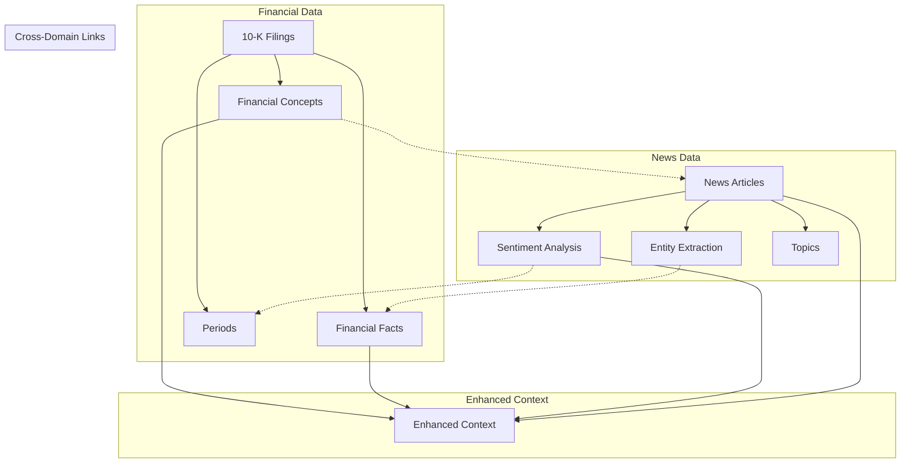

# Enhanced Knowledge Graph Query System

## Overview

The enhanced `kg_query.py` system now integrates **news articles with sentiment analysis** alongside the existing 10-K financial data, providing comprehensive strategic analysis that combines:

- **Financial metrics** from SEC filings
- **Market sentiment** from news articles  
- **Timeline correlation** between events and market reactions
- **Cross-domain entity linking** between financial and news data
- **Sentiment-aware strategic insights**

## New Capabilities

### 1. News Article Integration

The system now retrieves and analyzes news articles that mention the organization, providing:

- **Content matching**: Articles relevant to the query topic
- **Sentiment analysis**: VADER sentiment scores (positive/negative/neutral)
- **Publisher information**: Source attribution and credibility context
- **Entity extraction**: People, organizations, and concepts mentioned
- **Financial concept linking**: Connections to 10-K filing concepts

### 2. Sentiment Timeline Analysis

Track market sentiment around key financial events:

- **Filing correlation**: News sentiment within ±60 days of SEC filings
- **Event reaction analysis**: How market sentiment changed after earnings/announcements
- **Temporal patterns**: Sentiment trends over time periods
- **Market timing**: Pre/post filing sentiment shifts

### 3. Enhanced Context Building

The query system now provides enriched context with:

```
<<NEWS SENTIMENT SUMMARY (Last 90 Days)>>
- Total articles: 45
- Average sentiment: 0.127 (Positive)
- Distribution: 18 positive, 12 negative, 15 neutral

<<RECENT NEWS ARTICLES WITH SENTIMENT>>
- 2024-01-15 [Reuters]: IBM beats Q4 earnings expectations... [Sentiment: positive (0.34)] [Financial: revenue, earnings]

<<NEWS SENTIMENT AROUND FILING DATES>>
- 10-K filing 2024-02-28 → 2024-03-02 (2 days after): IBM reports strong cloud growth... [Sentiment: positive (0.41)]
```

## Usage Examples

### Basic Enhanced Query

```bash
python kg_query.py --prompt "IBM financial performance and market sentiment analysis" --show-context
```

### Sentiment-Focused Analysis

```bash
python kg_query.py --prompt "How did market sentiment change around IBM's recent earnings?" --show-context
```

### Strategic Analysis with Market Intelligence

```bash
python kg_query.py --prompt "IBM cloud strategy effectiveness based on financial results and market reaction" --show-context
```

## New Query Patterns

### 1. Sentiment Correlation Queries

```python
"What is the relationship between IBM's revenue growth and news sentiment?"
"How does market sentiment correlate with IBM's stock performance?"
```

### 2. Event Impact Analysis

```python
"How did the market react to IBM's latest acquisition announcement?"
"What was the sentiment impact of IBM's earnings miss last quarter?"
```

### 3. Timeline Analysis

```python
"Show me the sentiment timeline around IBM's major announcements in 2024"
"How did news coverage change before and after IBM's strategy shift?"
```

### 4. Competitive Intelligence

```python
"Compare market sentiment between IBM and its competitors"
"What are the market concerns about IBM's competitive position?"
```

## Data Integration Architecture



## Context Sections

The enhanced query system provides these context sections:

### Financial Context
- **Facts with Trends**: Time-series financial metrics with historical context
- **Narrative with Links**: 10-K narrative text with concept and entity cross-references

### News & Sentiment Context  
- **Sentiment Summary**: Aggregate sentiment statistics for recent period
- **Recent Articles**: Latest news articles with sentiment scores and concept links
- **Sentiment Timeline**: News sentiment correlated with filing dates

### Strategic Context
- **Time-Series Data**: Key financial metrics over time
- **Risk Factors**: Risk-related narrative from filings
- **Strategic Initiatives**: Strategy-related content from disclosures

## Query Performance

### Retrieval Strategy
- **Parallel Processing**: Financial, narrative, and news queries run concurrently
- **Intelligent Fallbacks**: Graceful degradation when fulltext indexes unavailable
- **Optimized Limits**: Balanced context size for comprehensive yet focused analysis

### Context Distribution
- **Financial Facts**: k/3 most relevant financial metrics
- **Narrative Context**: k/3 most relevant filing sentences  
- **News Articles**: k/3 most relevant news articles with sentiment
- **Strategic Context**: Targeted queries based on question type

## Configuration

### Environment Variables

```bash
# Neo4j Configuration (same as before)
export NEO4J_URI=bolt://localhost:7687
export NEO4J_USER=neo4j
export NEO4J_PASSWORD=neo4j_password
export NEO4J_DB=neo4j

# LLM Configuration (same as before)
export LLM_BACKEND=ollama
export OLLAMA_MODEL=gpt-oss:20b
```

### Prerequisites

1. **10-K Data**: Existing financial filing data from `ingest_10k_to_neo4j.py`
2. **News Data**: News articles ingested via `ingest_news_to_neo4j.py`
3. **Neo4j Indexes**: Both `sentenceText` and `articleContent` fulltext indexes

## Testing

Run the test script to verify enhanced functionality:

```bash
python test_enhanced_query.py
```

This will test:
- Organization resolution
- News context retrieval  
- Sentiment analysis integration
- Comprehensive context building
- Cross-domain entity linking

## Sample Enhanced Analysis Output

When you run an enhanced query, you'll get analysis that includes:

### Quantitative Financial Analysis
- Revenue trends over multiple periods
- Profitability metrics and ratios
- Balance sheet strength indicators
- Cash flow patterns

### Market Sentiment Integration  
- Overall sentiment trend (positive/negative/neutral)
- Sentiment correlation with financial events
- Market reaction timing analysis
- Sentiment driver identification

### Strategic Insights
- Market perception of strategic initiatives
- Competitive positioning sentiment
- Risk factor market awareness
- Future outlook consensus

### Timeline Correlation
- Pre/post earnings sentiment shifts
- Announcement impact analysis
- Filing date reaction patterns
- Market timing insights

## Advanced Features

### 1. Sentiment-Aware Recommendations

The LLM now provides recommendations that consider both financial fundamentals and market sentiment:

- **Bull Case**: Strong financials + positive sentiment
- **Bear Case**: Weak metrics + negative sentiment  
- **Contrarian Opportunities**: Strong fundamentals + negative sentiment
- **Momentum Plays**: Improving metrics + positive sentiment

### 2. Risk Assessment Enhancement

Risk analysis now includes market perception factors:

- **Financial Risks**: From 10-K risk factor disclosures
- **Sentiment Risks**: Negative sentiment patterns and concerns
- **Market Timing Risks**: Sentiment volatility around events
- **Perception Gaps**: Disconnect between fundamentals and sentiment

### 3. Strategic Planning Support

Enhanced strategic insights combine internal capabilities with market expectations:

- **Market Validation**: Do strategic initiatives have market support?
- **Communication Effectiveness**: How well are strategies being received?
- **Competitive Positioning**: Market perception vs. competitors
- **Execution Tracking**: Sentiment response to strategic progress

## Troubleshooting

### Common Issues

1. **No News Data Found**
   ```
   Ensure news ingestion completed: python ingest_news_to_neo4j.py
   Check date ranges and organization linking
   ```

2. **Missing Sentiment Scores**
   ```
   Verify sentiment analysis ran during news ingestion
   Check Sentiment node creation in Neo4j
   ```

3. **Poor Context Quality**
   ```
   Adjust query parameters (k value) for more/less context
   Verify fulltext indexes are created and populated
   ```

### Performance Optimization

1. **Large News Datasets**
   - Adjust time windows for sentiment analysis
   - Use date-based filtering for recent articles only
   - Optimize Neo4j memory settings

2. **Query Response Time**
   - Reduce context size (k parameter) for faster responses
   - Use more specific queries to improve relevance
   - Consider parallel processing for multiple organizations

## Integration with Existing Workflows

The enhanced system maintains backward compatibility while adding new capabilities:

### Existing Features (Unchanged)
- ✅ 10-K financial data retrieval
- ✅ Concept and fact analysis  
- ✅ Strategic context building
- ✅ CLI and MCP server modes
- ✅ Organization resolution

### New Features (Added)
- 🆕 News article integration
- 🆕 Sentiment analysis context
- 🆕 Timeline correlation analysis
- 🆕 Cross-domain entity linking
- 🆕 Market perception insights

The enhanced query system provides a comprehensive foundation for strategic analysis that combines the rigor of financial data with the insights of market sentiment, enabling more nuanced and actionable business intelligence.
